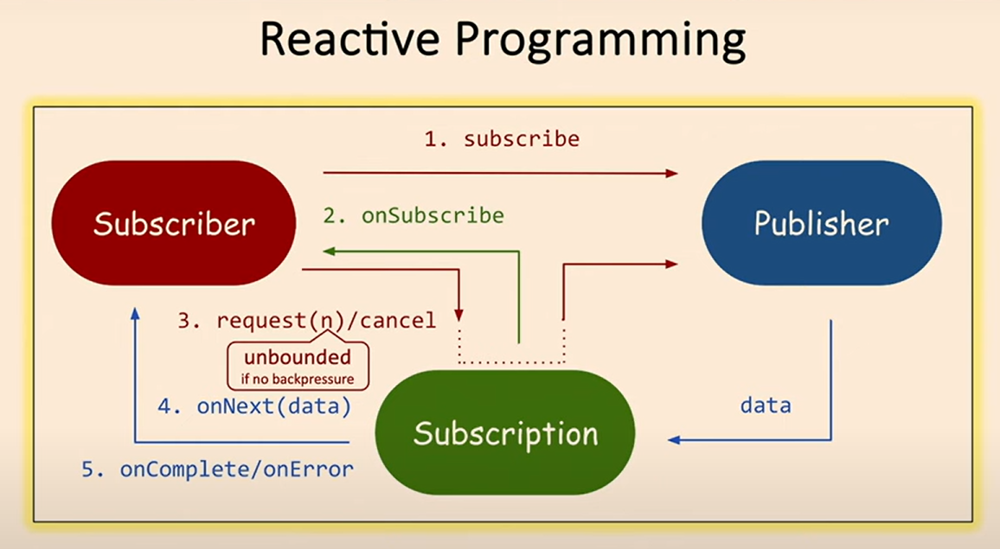
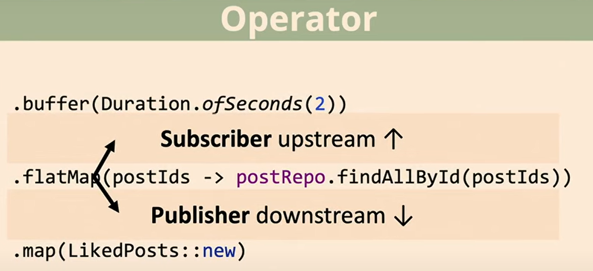

## Reactive programming with Webflux, MongoDB reactive

1) Discover different functions/operators of Mono and Flux interfaces
2) Simulate Http reactive API
3) Discover backpressure and different strategies

To launch this app on your laptop, make sur you have a mongoDB database named 'learning' 

## Some methods/operators to know:
1) **Mono.switchIfEmpty()** : 
<i>
is a method that allows you to provide an alternative
Mono to subscribe to if the source Mono completes empty (i.e., it does not emit any value). 
</i>

2) **Mono.zip()** : 
<i>
is used to combine multiple Mono publishers by merging their emitted items into a single `Mono`. Here's how it works:
It combines the results of up to several Mono instances into a new Mono, emitting a tuple containing the combined results or a computed value.
This is useful for when you want to wait for multiple asynchronous computations to complete and process their results together.
</i>

3) **Mono.flatMap()** :
<i>
is used to manipulate reactive data streams asynchronously. It takes a function that returns another 
Mono or Flux (a reactive editor) and flattens the result.
</i>

4) **Mono.error()** :
<i>
is used to create a Mono object that immediately signals an error.
</i>

5) **Mono.single()** :
<i>
The single() method in the Mono class indicates that a single value is expected. Specifically, it does the following:
If the publisher emits **exactly one element**, it passes that element to the downstream.
If the publisher emits **no elements**, it throws a NoSuchElementException.
If the publisher emits **more than one element**, it throws an IllegalArgumentException.
</i>
 
6) **Mono.single().cache()** :
<i>
The cache() operator is a valid Reactor method. It allows caching the result of the Mono.  
This means that once the Mono operation has been computed (completed), its result is stored and reused for all subsequent subscribers, 
rather than recomputing it for each new subscription.
It is particularly useful when the resulting value of the Mono is expensive to compute, and you want to avoid recomputing it multiple times.
</i>

## Illustrations

